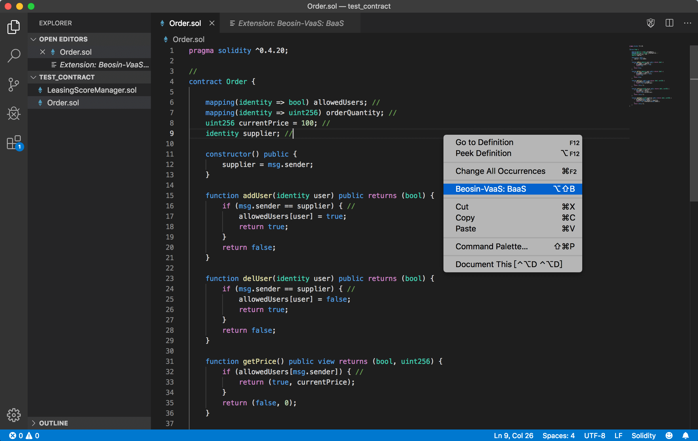
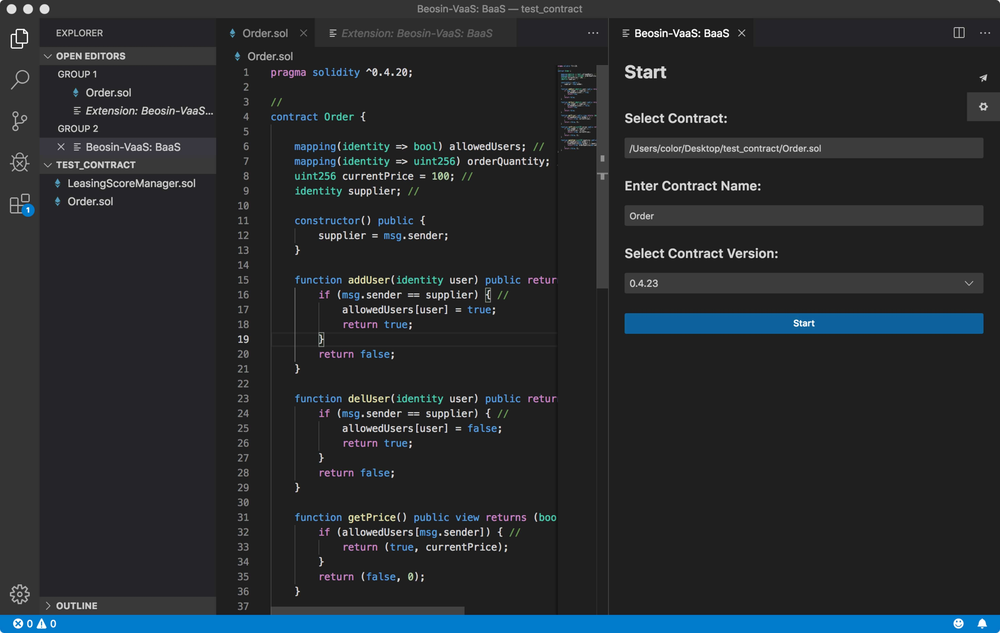
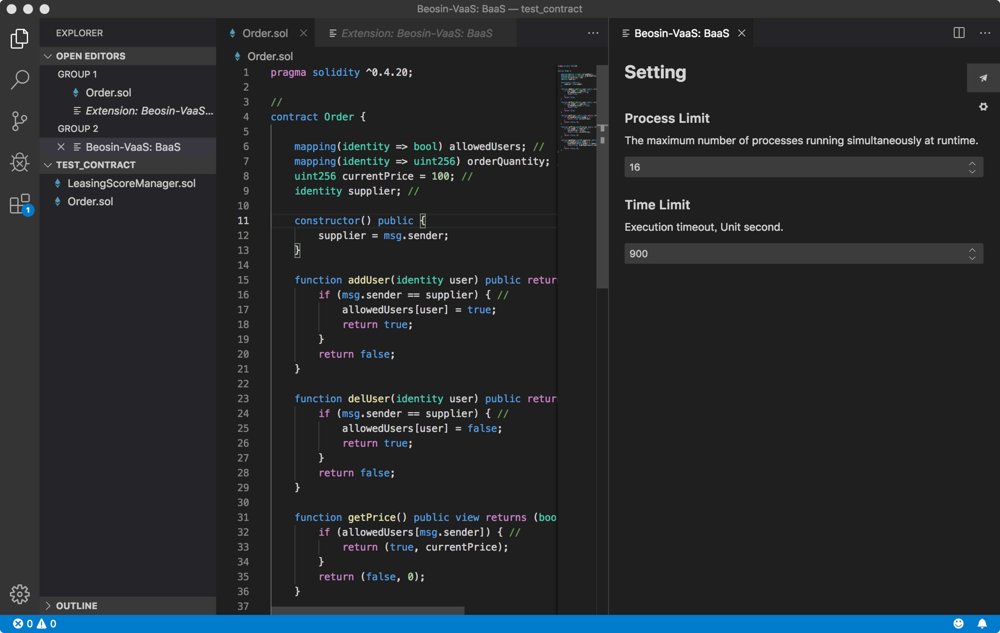
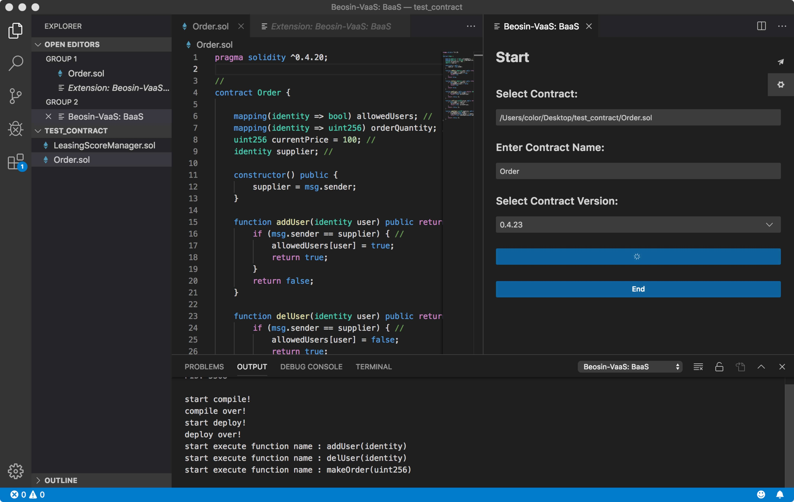
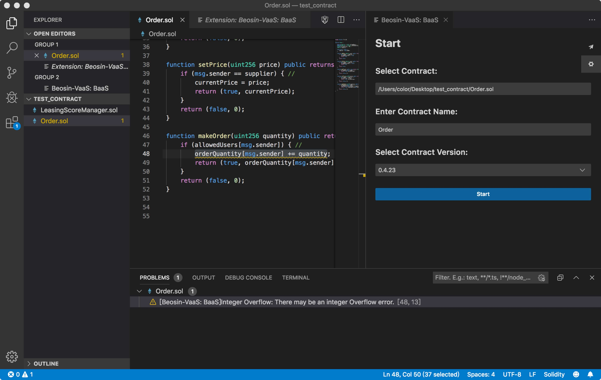
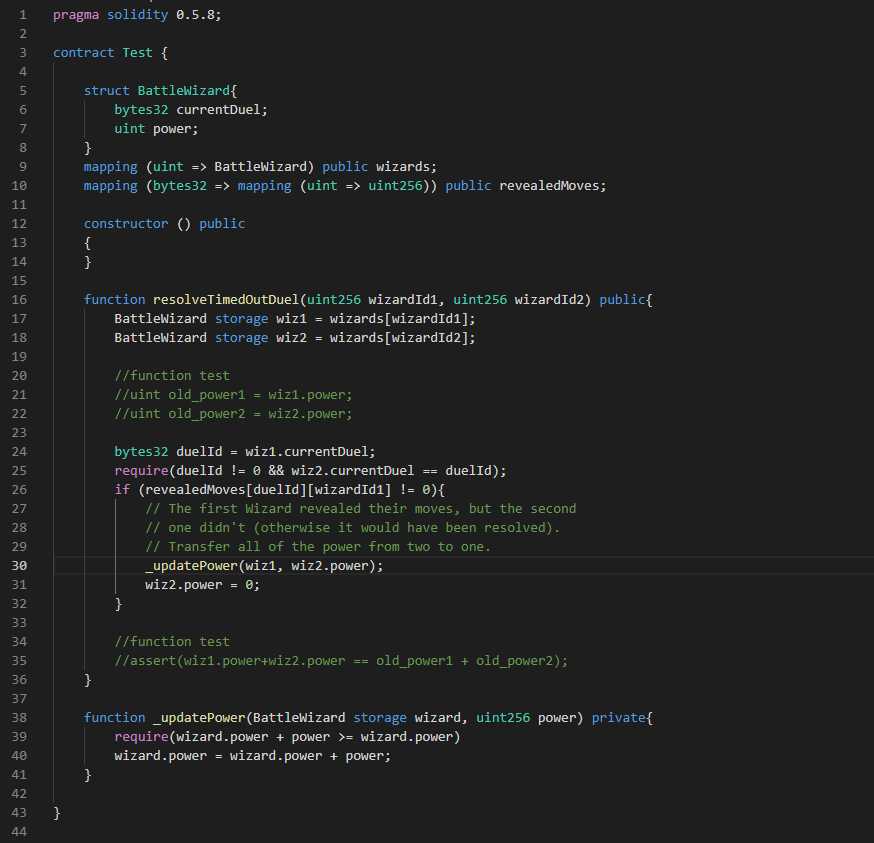
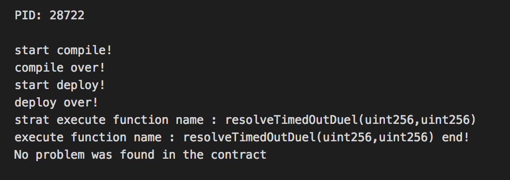
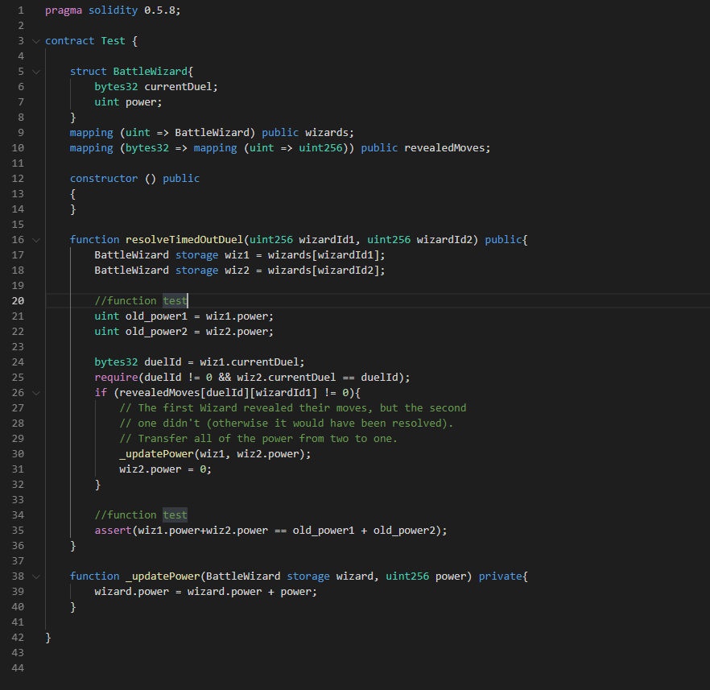
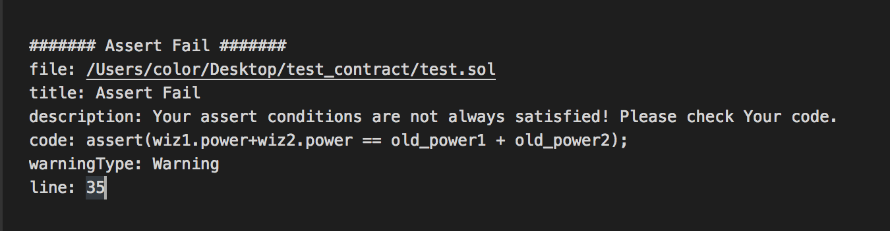

# Beosin-VaaS: BaaS 

### 产品介绍：
本产品为`Beosin-VaaS`针对蚂蚁`BaaS`智能合约安全检测开发的定制化工具。`Beosin-VaaS`一键式智能合约自动形式化验证工具可精确定位到有风险的代码位置并指出风险原因，有效的检测智能合约常规安全漏洞，精确度高达95%以上，为智能合约代码提供“军事级”的安全验证。
`Beosin-VaaS`面向蚂蚁金服区块链`BaaS`平台的智能合约自动形式化验证工具，能够“一键式”自动检测包括五大项、二十四小项常规安全漏洞。并且会随着版本的迭代不断增加新的检测项。
对`windows`系统的用户，需要保证电脑装有`Node.js`和`Visual C++`库，否则插件运行时可能出错。
`Node.js`下载地址：[https://nodejs.org/zh-cn/download/](https://nodejs.org/zh-cn/download/)。
`Visual C++`库下载地址：[https://visualstudio.microsoft.com/zh-hans/downloads/](https://visualstudio.microsoft.com/zh-hans/downloads/)，选择其他工具和框架中的`Microsoft Visual C++ Redistributable for Visual Studio 2019`下载安装。
本工具整个测试过程均在本地完成，这样可以打消用户对源码泄露的顾虑。另外，本工具基于`VS Code`实现了蚂蚁`BaaS`智能合约的代码高亮与代码补全，方便用户一边开发一边测试，在发现问题后迅速定位，快速修改。
### 使用方法：
安装完成后使用`VS Code`打开合约项目，选择合约文件 -> 右键(即可看见`Beosin-VaaS: BaaS`选项)：  

选择`Beosin-VaaS: BaaS`选项，出现操作界面：  

点击`settings`按钮(右上角⚙)可以自定义部分测试参数：
- `Process Limit`表示最多同时运行的进程数量（可以`cpu`核数限制，越大占用资源越多，测试时间越短）
- `Time Limit`表示时间限制，超过时间测试将自动结束  

选择将要测试的合约路径，输入主合约的名字，点击`Start`按钮开始测试：  

测试可能需要一段时间，请耐心等待。若想要停止测试可点击`End`按钮，此时结果显示为当前已进行的测试结果。
完成测试后，最终结果显示如下：  

### 结果说明：
工具的检测结果根据检测内容现在可分为五大项、二十四小项，并且会随着版本的迭代不断增加新的检测项。下面按分类对已有结果进行说明。
#### 1、代码规范检测
此大项主要针对合约编写时的一些代码规范进行检测，共有九小项。
- 1.1 Transfer To Zero Address  
在`transfer`、`transferFrom`、`transferOwnership`等敏感函数中，用户操作不可逆，所以建议开发者在这些函数实现中增加目标地址非零检查，避免用户误操作导致用户权限丢失和财产损失。
- 1.2 TX Origin Authentication  
`tx.origin`是`Solidity`的一个状态变量，它遍历整个调用栈并返回最初发送调用（或事务）的帐户的地址。在智能合约中使用此变量进行身份验证会使合约容易受到类似网络钓鱼的攻击。
- 1.3 Constructor Mistyping  
构造函数仅在合约部署的时候被调用，合约`owner`的设置一般放在构造函数中，合约的构造函数还会执行初始化的操作。在使用`function`的方式定义构造函数时，如果函数名与合约名失配，就变成了一个普通函数。那么，合约将存在重大安全风险。
- 1.4 Complex Code In Fallback Function  
合约的`fallback`函数通常用以接收一笔`eth`转账，但如果在`fallback`里实现过于复杂的逻辑，可能会将`gas`耗尽，导致转账不成功。
- 1.5 Unary Operation  
当定义的操作的意图是将数字与变量`+=`相加但却意外地以错误的方式定义`=+`时，会出现错误。它不是计算总和，而是再次初始化变量。
- 1.6 Redefine Variable From Base Contracts  
`Solidity`中同一合约或不同合约允许有相同的状态变量，他们不会构成直接威胁，在单个相当于重新定义了这个变量，在多个合约中继承使用时会出现先后关系和使用错误的情况，所以尽量避免出现相同的状态变量。
- 1.7 Unused Variables  
`Solidity`中允许有未使用的变量，它们不会构成直接的安全问题，但会降低代码的可读性并且额外占用存储空间导致部署时的资源消耗增加。
- 1.8 No Return  
如果声明一个函数有返回值，而最后没给它返回值，就会产生一个默认的返回值，而默认返回值和实际执行后的返回值可能存在差异。
- 1.9 Overload Syscall  
对于`Solidity`已内置函数如`assert`，或者`BaaS`内置的系统函数如`property_parse`等，如果在合约中进行了重定义，可能会出现异常。
#### 2、函数调用检测
此大项用于检查合约中在进行函数调用时可能出现的问题，共有四小项。
- 2.1 Invoke Low Level Calls  
`call`是以太坊智能合约编写语言`Solidity`提供的底层函数，用来与外部合约或者库进行交互。此类函数使用时需要对调用参数的安全性进行判定；`delegatecall`会保持调用环境不变的属性表明，构建无漏洞的定制库并不像人们想象的那么容易。库中的代码本身可以是安全的，无漏洞的，但是当在另一个应用的环境中运行时，可能会出现新的漏洞；`selfdestruct`自杀函数的调用会销毁合约。
- 2.2 Invoke Extcodesize  
`extcodesize`在合约部署的时候为零，攻击者可以在自己的构造函数中调用受害合约，这个时候使用`extcodesize`验证是无效的。
- 2.3 Invoke Ecrecover  
`keccak256()`和`ecrecover()`都是内嵌的函数，`keccak256()`可以用于计算公钥的签名，`ecrecover()`可以用来恢复签名公钥。传值正确的情况下，可以利用这两个函数来验证地址。但当`ecrecover()`的参数错误时候，返回`0x0`地址，如果`_from`也传入`0x0`地址，就能通过校验。也就是说，任何人都可以将`0x0`地址的余额转出
- 2.4 Unchecked Call Or Send Return Values  
在调用`call`/`send`函数后无论执行成功还是失败都不会直接抛异常，如果不对调用返回值进行检查，函数会继续执行。
#### 3、业务逻辑安全检测
此大项主要用于检查可能导致业务逻辑出现安全风险的问题，共有五个检查项。
- 3.1 Block Members Manipulation  
区块参数依赖风险主要有时间戳依赖和区块哈希依赖，这种风险主要来自于使用他们生成随机数，因为它们可以被操纵或者被攻击者获取，所以不应该用于随机种子。
- 3.2 Arbitrary Jump with Function Type Variable  
由于`Solidity`不支持指针算术，因此无法将此变量更改为任意值。但是，如果开发人员在最坏的情况下使用汇编指令（例如或赋值运算符），则攻击者可以将函数类型变量指向任何代码指令，从而违反所需的验证和所需的状态更改。
- 3.3 Unchecked Api Return Values  
检测接受到的API返回值是否正确，如果不做判断，有可能合约继续执行，实际已经发生错误。
- 3.4 Emit Event Before Revert  
针对`BaaS`的规则，因为`revert`会使整个交易回滚，但`BaaS`的发出的交易信息不会回滚，实际没产生交易，但是消息已发出。
- 3.5 Function Problem  
函数永远只会以`revert()`等异常状态结束，无法正常执行完后`return`，说明函数设计出现了问题。
- 3.6 Call Problem  
`Call`调用永远失败，说明函数设计出现了问题。

#### 4、溢出检测。
溢出是典型的合约漏洞，可能导致检查被绕过，合约运行逻辑出错。在此大项中，VaaS主要进行了三小项的检测。
- 4.1 Exponent Arithmetic Overflow
- 4.2 Integer Overflow
- 4.3 Integer Underflow

#### 5、异常可达状态检测
用于检测合约在执行过程中可能出现的异常状态，共有两个检查项。
- 5.1 Assert Fail  
`assert`的限制条件是必须满足的，在条件可能不满足的情况下会报错，说明合约运行状态异常。
- 5.2 Require Fail  
与`assert`类似，默认reqiure条件是可能满足的，当条件在任何情况下都无法满足会报错，说明合约运行状态异常

### 业务逻辑测试方法：
因为`VaaS`支持异常可达状态检测，所以在使用`VaaS`时可以通过添加`require`和`assert`来测试函数的业务逻辑是否有问题。下面以最近曝出的以太坊游戏合约`Cheeze Wizards`的漏洞为例做一个简单的说明：

上图为合约中问题函数`resolveTimeOutDuel`的简单实现，若直接由`VaaS`进行检测不会发现任何问题。  

根据函数的说明可以知道，`resolveTimeOutDuel`是在决斗超时的情况下被调用，当满足一定的条件后，会将`wiz2`的`power`转移到`wiz1`上。根据这个逻辑我们很容易可以得到一个结论，那就是无论条件是否满足，函数执行前`wiz1.power+wiz2.power`和执行后的`wiz1.power+wiz2.power`应该相等。所以可以在函数起始和结束添加代码来描述这个逻辑：

这样再通过`VaaS`进行检测时`35`行就会报告`Assert Fail`：

说明执行前后的`power`总数有可能出现变化，合约设计有问题。稍加检查就能发现当`wiz1 == wiz2`时，`wiz1.power`被设为`0`了，所以需要加上`require(wiz1 != wiz2)`的限制。